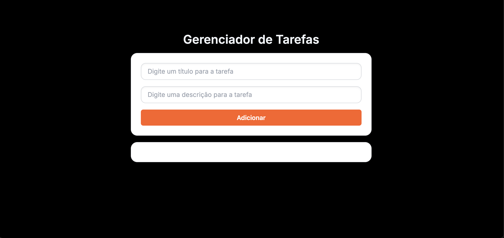

# 📋 ToDo List com React

Este projeto é uma aplicação simples de *ToDo List* desenvolvida com *React.js*, com o objetivo de aplicar os principais conceitos aprendidos em aula sobre a biblioteca.

## 📸 Preview

## 🚀 Funcionalidades

- Adicionar novas tarefas com título e descrição
- Visualizar detalhes de cada tarefa
- Marcar tarefas como concluídas
- Remover tarefas
- Interface simples e responsiva com Tailwind CSS

## 🧠 Conceitos Aplicados

- Componentização com React
- useState para gerenciamento de estado
- Uso do armazenamento no localstorage
- Consumo de API externa
- Uso de UUID para Identificação
- Passagem de props entre componentes
- Manipulação de eventos
- Renderização condicional
- Estilização com Tailwind CSS

## 🛠 Tecnologias Utilizadas

- [React.js](https://reactjs.org/)
- [Vite](https://vitejs.dev/)
- [Tailwind CSS](https://tailwindcss.com/)

## 🌐 Projeto Online

Acesse a aplicação no navegador:  
👉 [https://to-do-list-react-pi-kohl.vercel.app/](https://to-do-list-react-pi-kohl.vercel.app/)

